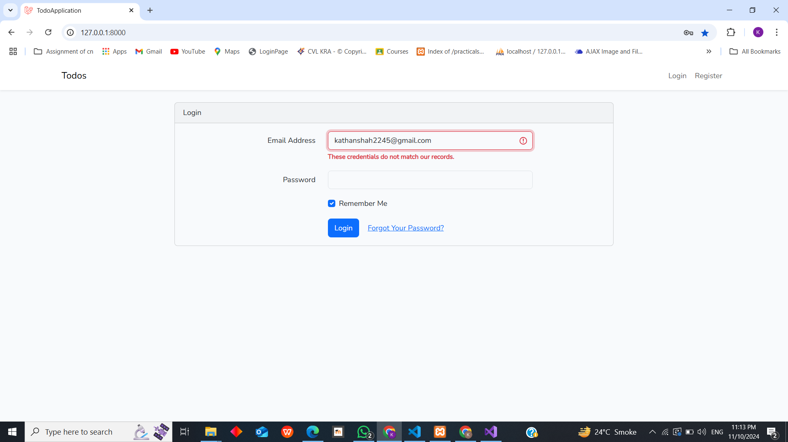

# Task Management Application

A simple task management application built using Laravel PHP and MySQL. This application allows users to manage their to-do lists with features like adding, viewing, editing, deleting, and marking tasks as completed. It also includes basic authentication functionality such as login, logout, registration, and forgot password.


## Features

### Task Management
- **Add Tasks**: Users can add new tasks to their to-do list.
- **View Tasks**: Users can view a list of all their tasks.
- **Edit Tasks**: Users can edit the details of existing tasks.
- **Delete Tasks**: Users can delete tasks from the list.
- **Mark Tasks as Completed**: Users can mark tasks as completed and unmark them if needed.

### Authentication
- **User Registration**: New users can register for an account.
- **Login/Logout**: Registered users can log in and log out of their accounts.
- **Forgot Password**: Users can reset their password via email if they forget it.

## Technologies Used

- **Backend**: Laravel PHP
- **Database**: MySQL
- **Frontend**: Blade templating engine (Laravel)

## Getting Started

### Prerequisites

To run this project locally, you will need:

- PHP 8.x or higher
- Composer
- MySQL database
- Laravel 9.x or higher

### Installation

1. **Clone the repository**:
   ```bash
   git clone https://github.com/yourusername/task-management-app.git
   cd task-management-app
   ```

2. **Install dependencies**:
    ```bash
    composer install
    ```

3. **Environment Setup**:
- Copy the .env.example file to .env:
    ```bash
    cp .env.example .env
    ```
- Open the .env file and update the database credentials:
    ```bash
    DB_CONNECTION=mysql
    DB_HOST=sql204.infinityfree.com
    DB_PORT=3306
    DB_DATABASE=if0_37687400_todoapp
    DB_USERNAME=if0_37687400
    DB_PASSWORD=Kathan2232
    ```

- Set up email credentials for password reset functionality:
    ```bash
    MAIL_MAILER=smtp
    MAIL_HOST=smtp.example.com
    MAIL_PORT=587
    MAIL_USERNAME=your_email@example.com
    MAIL_PASSWORD=your_password
    MAIL_ENCRYPTION=tls
    MAIL_FROM_ADDRESS=your_email@example.com
    MAIL_FROM_NAME="${APP_NAME}"
    ```

4. **Generate application key**:
    ```bash
    php artisan key:generate
    ```

5. **Run database migrations**:
    ```bash
    php artisan migrate
    ```

6. **Seed the database (Optional: if you have seeders)**:
    ```bash
    php artisan db:seed
    ```

### Running the Application

Start the Laravel development server:
```bash
php artisan serve
```

Visit TodoApplication.infinityfreeapp.com in your browser to access the application.

.png)

## API Endpoints


| Method | Endpoint                 | Description                     |
|--------|---------------------------|---------------------------------|
| POST   | `/create`                 | Add a new task                  |
| GET    | `/index/`                 | View all tasks
| GET    | `/show/{id}`                 | View single task                  |
| PUT    | `/update`            | Edit an existing task           |
| DELETE | `/destroy`            | Delete a task                   |
| POST   | `/register`              | Register a new user             |
| POST   | `/login`                 | User login                      |
| POST   | `/logout`                | User logout                     |
| POST   | `/password/email`        | Send password reset email       |
| POST   | `/password/reset`        | Reset password                  |





